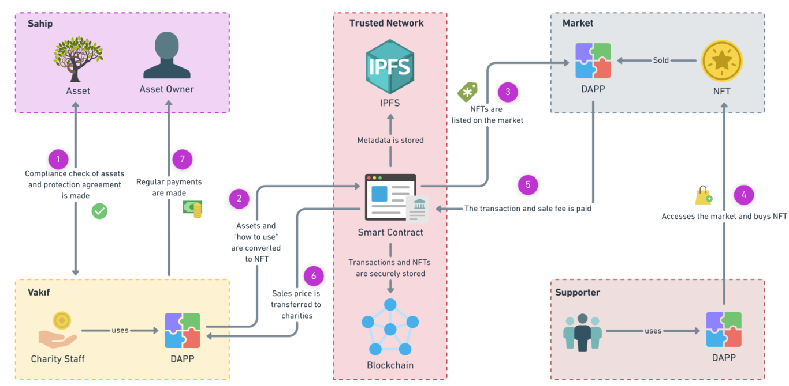

# Save Our Heirlooms

Cultural heritage is historical artifacts or assets with universal values that have survived past generations and are preserved and transferred to future generations. These assets are a pillar of the tourism industry that provides significant economic value to local communities. Various assets worldwide are faced with the danger of destruction due to lack of publicity and financial problems. Technological developments can play a role in their protection and promotion. This study aims to create a decentralized cultural assets protection system (CAPS). The proposed system uses blockchain technology. This system allows various assets to be transformed into unique digital items using NFT technology and sold by auction to ensure their protection. In this study, Quorum is selected as the blockchain framework as an energy-efficient blockchain solution. Smart contracts are used for an autonomous system. The proof of concept implementation and the performance tests are given. The results are promising. Finally, the challenges of deploying augmented reality (AR) methods remain as future studies.

  
